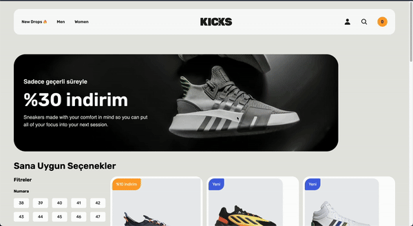

**Shoes App** is an interactive e-commerce application where users can browse, filter, and purchase shoes. The app features filtering options for size, color, and price range, and users can view detailed information about individual shoes and add their selected items to the cart.

## Features

- **Shoe Details**: Click on any shoe to view its detailed information, including size, color, and price.
- **Filter Options**: Filter shoes on the homepage by size, color, or price range for a personalized shopping experience.
- **Cart Management**: Add selected shoes to the cart and manage them.
- **Responsive Design**: Optimized for seamless use across devices.

## Technologies Used

- **React**: Core framework for building the user interface.
- **React Router DOM**: Handles navigation and routing between pages.
- **Tailwind CSS**: Provides a sleek and responsive design for the app.
- **Axios**: Facilitates communication with the backend for fetching data.
- **JSON Server**: Simulates a backend server to provide product data.
- **@tanstack/react-query**: Manages server state efficiently and caches API requests.
- **React Toastify**: Displays toast notifications for user interactions like adding items to the cart.

# Shoes_app-reactquery
# Shoes_app-reactquery
# Shoes_app-reactquery
# Shoes_App-tanstack-query
# Shoes_App-tanstack-query
